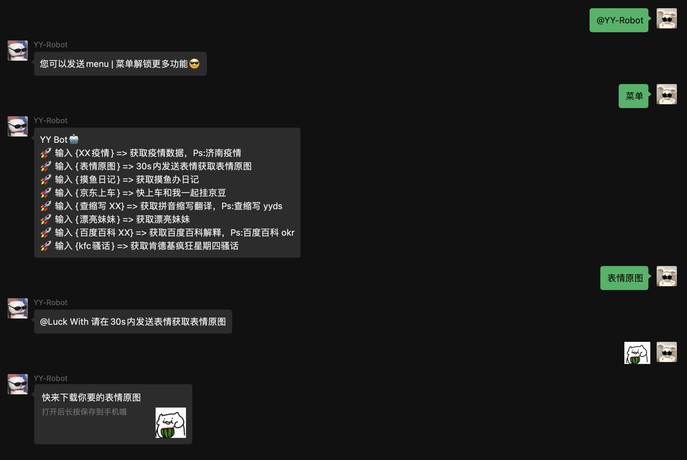
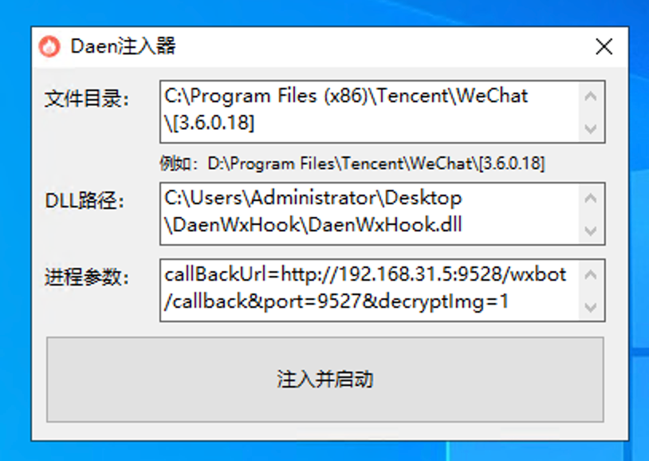
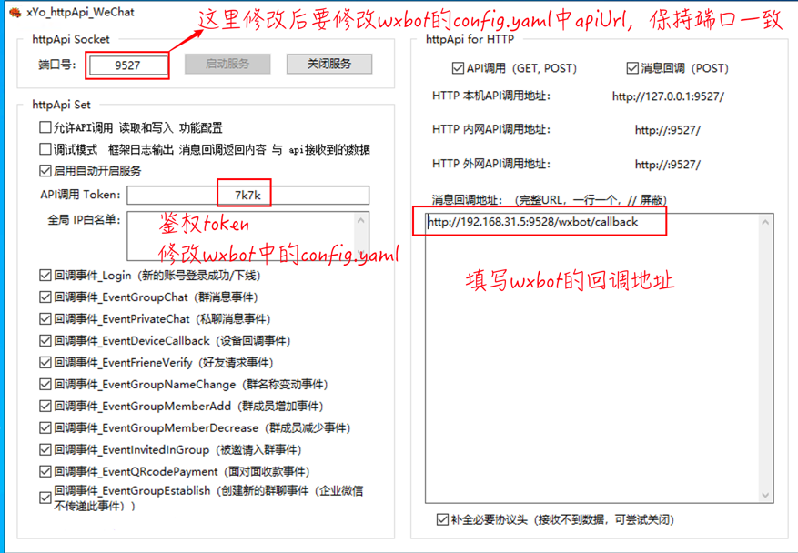

# WxBot

* [What's this?](#whats-this)
    * [已对接框架](#已对接框架)
    * [已对接API](#已对接api)
    * [已有插件](#已有插件)
    * [指令大全](#指令大全)
* [How to use?](#how-to-use)
    * [本地运行](#本地运行)
    * [Releases包](#releases包)
    * [Docker运行](#docker运行)
    * [Actions编译](#actions编译)
* [How to develop?](#how-to-develop)
    * [制作插件或接入其他框架](#制作插件或接入其他框架)
    * [参考案例](#参考案例)
    * [调试-环境变量](#调试-环境变量)
    * [提交Pr注意项](#提交pr注意项)
* [Feature](#feature)
* [Thanks](#thanks)
* [Support](#support)
* [License](#license)

## What's this?

一个还算有意思的wechat robot项目，理想将其设计成一个多功能的机器人助手 😈

* 🤨框架可无侵入扩展，现已接入`Dean DLL`、~~`千寻框架`~~、`vlw框架`，请参考`framework`目录
* 🤨功能可无侵入扩展，现已集成`plugins`目录下的功能，请参考`plugins`目录
* 🤨新手视频教程 📺
    * BiliBili：[https://www.bilibili.com/video/BV1Q84y1c7iF](https://www.bilibili.com/video/BV1Q84y1c7iF)
    * YouTube：[https://www.youtube.com/watch?v=JMeEa7ETIL0](https://www.youtube.com/watch?v=JMeEa7ETIL0)

**🔔 注意：**

1. 使用本项目之前需要您已经配置好相关的 `微信的hook` 类软件，那么只需要在这类软件上设置回调地址即可
2. 本项目已接入`Dean DLL`、~~`千寻`~~、`vlw`三个框架，如果您有其他框架，可自行添加(参考`framework`目录，实现`IFramework`接口即可)，或联系我添加
3. 本项目不提供任何`hook`类软件，您需要利用搜索引擎自行寻找
4. 本项目暂时只支持HTTP协议，关于websocket协议支持目前不考虑
5. 简而言之，本项目是一个消息处理的中间件，微信消息监听获取是从框架获取
6. 本项目仅供学习交流使用，不得用于商业用途，否则后果自负
7. 使用本项目造成封禁账号等后果，本项目不承担任何责任，实际上您使用任何非官方的微信机器人都有可能造成账号封禁，所以请谨慎使用
8. 如果您阅读了上面的内容，觉得没有问题，那么请继续阅读下面的内容

**功能示例：**



### 已对接框架

<details open>
<summary>🎁 已接入框架，展开看👇</summary>

* [x] [Dean DLL](https://gitee.com/qxvxhook/pc-vx-hook-http-api/tree/36018/DaenWxHook) | [👉对接说明文档👀](docs/deandll.md)
  * 具体配置查看 `config.yaml` 文件注释说明
  * 
* [x] [VLW框架](https://github.com/yqchilde/wxbot)
    * 具体配置查看 `config.yaml` 文件注释说明
    * 

</details>

### 已对接API

<details>
<summary>🎁 已对接API，展开看👇</summary>

```go
// IFramework 这是接入框架所定义的接口
type IFramework interface {
	// Callback 这是消息回调方法，vx框架回调消息转发给该Server
	Callback(func(*Event, IFramework))

	// GetMemePictures 获取表情包图片地址(迷因图)
	// return: 图片链接(网络URL或图片base64)
	GetMemePictures(message *Message) string

	// SendText 发送文本消息
	// toWxId: 好友ID/群ID
	// text: 文本内容
	SendText(toWxId, text string) error

	// SendTextAndAt 发送文本消息并@，只有群聊有效
	// toGroupWxId: 群ID
	// toWxId: 好友ID/群ID/all
	// toWxName: 好友昵称/群昵称，留空为自动获取
	// text: 文本内容
	SendTextAndAt(toGroupWxId, toWxId, toWxName, text string) error

	// SendImage 发送图片消息
	// toWxId: 好友ID/群ID
	// path: 图片路径
	SendImage(toWxId, path string) error

	// SendShareLink 发送分享链接消息
	// toWxId: 好友ID/群ID
	// title: 标题
	// desc: 描述
	// imageUrl: 图片链接
	// jumpUrl: 跳转链接
	SendShareLink(toWxId, title, desc, imageUrl, jumpUrl string) error

	// SendFile 发送文件消息
	// toWxId: 好友ID/群ID/公众号ID
	// path: 本地文件绝对路径
	SendFile(toWxId, path string) error

	// SendVideo 发送视频消息
	// toWxId: 好友ID/群ID/公众号ID
	// path: 本地视频文件绝对路径
	SendVideo(toWxId, path string) error

	// SendEmoji 发送表情消息
	// toWxId: 好友ID/群ID/公众号ID
	// path: 本地动态表情文件绝对路径
	SendEmoji(toWxId, path string) error

	// SendMusic 发送音乐消息
	// toWxId: 好友ID/群ID/公众号ID
	// name: 音乐名称
	// author: 音乐作者
	// app: 音乐来源(VLW需留空)，酷狗/wx79f2c4418704b4f8，网易云/wx8dd6ecd81906fd84，QQ音乐/wx5aa333606550dfd5
	// jumpUrl: 音乐跳转链接
	// musicUrl: 网络歌曲直链
	// coverUrl: 封面图片链接
	SendMusic(toWxId, name, author, app, jumpUrl, musicUrl, coverUrl string) error

	// SendMiniProgram 发送小程序消息
	// toWxId: 好友ID/群ID/公众号ID
	// ghId: 小程序ID
	// title: 标题
	// content: 内容
	// imagePath: 图片路径, 本地图片路径或网络图片URL
	// jumpPath: 小程序点击跳转地址，例如：pages/index/index.html
	SendMiniProgram(toWxId, ghId, title, content, imagePath, jumpPath string) error

	// SendMessageRecord 发送消息记录
	// toWxId: 好友ID/群ID/公众号ID
	// title: 仅供电脑上显示用，手机上的话微信会根据[显示昵称]来自动生成 谁和谁的聊天记录
	// dataList:
	// 	- wxid: 发送此条消息的人的wxid
	// 	- nickName: 显示的昵称(可随意伪造)
	// 	- timestamp: 10位时间戳
	// 	- msg: 消息内容
	SendMessageRecord(toWxId, title string, dataList []map[string]interface{}) error

	// SendMessageRecordXML 发送消息记录(XML方式)
	// toWxId: 好友ID/群ID/公众号ID
	// xmlStr: 消息记录XML代码
	SendMessageRecordXML(toWxId, xmlStr string) error

	// SendFavorites 发送收藏消息
	// toWxId: 好友ID/群ID/公众号ID
	// favoritesId: 收藏夹ID
	SendFavorites(toWxId, favoritesId string) error

	// SendXML 发送XML消息
	// toWxId: 好友ID/群ID/公众号ID
	// xmlStr: XML代码
	SendXML(toWxId, xmlStr string) error

	// SendBusinessCard 发送名片消息
	// toWxId: 好友ID/群ID/公众号ID
	// targetWxId: 目标用户ID
	SendBusinessCard(toWxId, targetWxId string) error

	// AgreeFriendVerify 同意好友验证
	// v3: 验证V3
	// v4: 验证V4
	// scene: 验证场景
	AgreeFriendVerify(v3, v4, scene string) error

	// InviteIntoGroup 邀请好友加入群组
	// groupWxId: 群ID
	// wxId: 好友ID
	// typ: 邀请类型，1-直接拉，2-发送邀请链接
	InviteIntoGroup(groupWxId, wxId string, typ int) error

	// GetObjectInfo 获取对象信息
	// wxId: 好友ID/群ID/公众号ID
	// return: User, error
	GetObjectInfo(wxId string) (*User, error)

	// GetFriends 获取好友列表
	// isRefresh: 是否刷新 false-从缓存中获取，true-重新遍历二叉树并刷新缓存
	// return: []*User, error
	GetFriends(isRefresh bool) ([]*User, error)

	// GetGroups 获取群组列表
	// isRefresh: 是否刷新 false-从缓存中获取，true-重新遍历二叉树并刷新缓存
	// return: []*User, error
	GetGroups(isRefresh bool) ([]*User, error)

	// GetGroupMembers 获取群成员列表
	// groupWxId: 群ID
	// isRefresh: 是否刷新 false-从缓存中获取，true-重新遍历二叉树并刷新缓存
	// return: []*User, error
	GetGroupMembers(groupWxId string, isRefresh bool) ([]*User, error)

	// GetMPs 获取公众号订阅列表
	// isRefresh: 是否刷新 false-从缓存中获取，true-重新遍历二叉树并刷新缓存
	// return: []*User, error
	GetMPs(isRefresh bool) ([]*User, error)
}
```

</details>

### 已有插件

<details open>
<summary>🎁 已有插件 👇</summary>

* [x] [百度百科-点击查看使用说明](plugins/baidubaike)
    * `import _ "github.com/yqchilde/wxbot/plugins/baidubaike"`
* [x] [ChatGPT聊天-点击查看使用说明](plugins/chatgpt)
    * `import _ "github.com/yqchilde/wxbot/plugins/chatgpt"`
* [x] [KFC疯狂星期四骚话-点击查看使用说明](plugins/crazykfc)
    * `import _ "github.com/yqchilde/wxbot/plugins/crazykfc"`
* [x] [获取表情原图-点击查看使用说明](plugins/memepicture)
    * `import _ "github.com/yqchilde/wxbot/plugins/memepicture"`
* [x] [摸鱼办-点击查看使用说明](plugins/moyuban)
    * `import _ "github.com/yqchilde/wxbot/plugins/moyuban"`
* [x] [查拼音缩写-点击查看使用说明](plugins/pinyinsuoxie)
    * `import _ "github.com/yqchilde/wxbot/plugins/pinyinsuoxie"`
* [x] [获取美女图片-点击查看使用说明](plugins/plmm)
    * `import _ "github.com/yqchilde/wxbot/plugins/plmm"`
* [x] [查天气-点击查看使用说明](plugins/weather)
    * `import _ "github.com/yqchilde/wxbot/plugins/weather"`
* [x] [获取每日早报-点击查看使用说明](plugins/zaobao)
    * `import _ "github.com/yqchilde/wxbot/plugins/zaobao"`
* [x] [管理相关-点击查看使用说明](plugins/manager)
    * `import _ "github.com/yqchilde/wxbot/plugins/manager"`
* [x] [公众号监控转发-点击查看使用说明](plugins/ghmonitor)
    * `import _ "github.com/yqchilde/wxbot/plugins/ghmonitor"`
* [x] [聊天热词云-点击查看使用说明](plugins/ghmonitor)
    * `import _ "github.com/yqchilde/wxbot/plugins/wordcloud"`
* [x] [查ID-点击查看使用说明](plugins/chaid)
  * `import _ "github.com/yqchilde/wxbot/plugins/chaid"`
* [x] [有道翻译-点击查看使用说明](plugins/youdaofanyi)
  * `import _ "github.com/yqchilde/wxbot/plugins/youdaofanyi"`
* [x] [自动通过好友添加请求-点击查看使用说明](plugins/friendadd)
  * `import _ "github.com/yqchilde/wxbot/plugins/friendadd"`
* [x] [选择困难症帮手-点击查看使用说明](plugins/choose)
  * `import _ "github.com/yqchilde/wxbot/plugins/choose"`
* [x] [读取本地图片-点击查看使用说明](plugins/localimage)
  * `import _ "github.com/yqchilde/wxbot/plugins/localimage"`
* [x] [爬取图片到本地-点击查看使用说明](plugins/localimagespider)
  * `import _ "github.com/yqchilde/wxbot/plugins/localimagespider"`

</details>

### 指令大全

[点击查看机器人有哪些指令](docs/command.md)

## How to use?

### 本地运行

1. 克隆代码

```bash
git clone https://github.com/yqchilde/wxbot.git
```

2. 配置`config.yaml`

3. 调试运行或编译
   * 调试运行执行 `go run main.go`
   * 编译执行 `make release`

### Releases包

1. 去[Releases](https://github.com/yqchilde/wxbot/releases)下载对应系统的编译包，解压后执行二进制文件即可

### Docker运行

1. 方式一：一键脚本启动

```shell
bash -c "$(curl -fsSL https://raw.fastgit.org/yqchilde/wxbot/hook/docker/run.sh)"
```

2. 方式二：命令启动，注意提前配置`config.yaml`,否则会报错
```shell
docker run -d \
  --name="wxbot" \
  -p 9528:9528 \
  -v $(pwd)/config.yaml:/app/config.yaml \
  -v $(pwd)/data:/app/data \
  yqchilde/wxbot:latest
```

### Actions编译

1. 先`fork`本项目
2. 在 [https://github.com/settings/tokens](https://github.com/settings/tokens) 这里获取一个token用于给actions使用
3. 给项目添加一个秘钥，名字为`WXBOT_TOKEN`，值为上面获取的token
4. 自行创建一个tag，如`v1.0.0`，然后等待actions编译完成，编译完成后会在`release`中生成对应的`wxbot`文件


## How to develop?

### 制作插件或接入其他框架

🤔如果您想要扩展自己的插件，可以参考`plugins`目录下的插件

🤔如果您想要扩展其他框架，可以参考`frameworks`目录下的框架

🤔如果您需要增减插件，可编辑 [plugins.yaml](plugins.yaml) 中代码中去掉对应插件的导入或者添加对应插件的导入，照猫画虎即可

🔴修改完`plugins.yaml`后需要执行一次`make plugins`或`go generate -tags plugins ./engine/plugins`生成对应的`plugins.go`文件再去编译

```yaml
- "github.com/yqchilde/wxbot/plugins/baidubaike"   # 百度百科
- "github.com/yqchilde/wxbot/plugins/chatgpt"      # GPT聊天
- "github.com/yqchilde/wxbot/plugins/crazykfc"     # 肯德基疯狂星期四骚话
- "github.com/yqchilde/wxbot/plugins/ghmonitor"    # 公众号消息监控转发
- "github.com/yqchilde/wxbot/plugins/manager"      # 群组管理相关
- "github.com/yqchilde/wxbot/plugins/memepicture"  # 表情包原图
- "github.com/yqchilde/wxbot/plugins/moyuban"      # 摸鱼办
- "github.com/yqchilde/wxbot/plugins/pinyinsuoxie" # 拼音缩写翻译
- "github.com/yqchilde/wxbot/plugins/plmm"         # 漂亮妹妹
- "github.com/yqchilde/wxbot/plugins/weather"      # 天气查询
- "github.com/yqchilde/wxbot/plugins/zaobao"       # 每日早报
- "github.com/yqchilde/wxbot/plugins/wordcloud"    # 聊天热词
- "github.com/yqchilde/wxbot/plugins/chaid"        # 查wxId
- "github.com/yqchilde/wxbot/plugins/youdaofanyi"  # 有道翻译
```

### 参考案例

[查看更多使用案例](examples)

### 调试-环境变量

| 环境变量名 | 变量类型 | 说明                                                         |
| ---------- | -------- | ------------------------------------------------------------ |
| DEBUG      | bool     | 优先级大于其他`DEBUG_`开头的变量，开启后开启所有DEBUG模式<br />用于调试HTTP请求和调用日志文件名和行号 |
| DEBUG_LOG  | bool     | 用于调试调用日志文件名和行号                                 |

### 提交Pr注意项

1. import包时顺序要规范，先import标准库，再import第三方库，最后import自己的库，例如：
```go
import (
	"errors"
	"fmt"
	"strings"
	"sync"
	"time"

	"github.com/PullRequestInc/go-gpt3"

	"github.com/yqchilde/wxbot/engine/control"
	"github.com/yqchilde/wxbot/engine/pkg/log"
	"github.com/yqchilde/wxbot/engine/pkg/sqlite"
	"github.com/yqchilde/wxbot/engine/robot"
)
```

2. 若提交的是`插件`，请在`plugins.yaml`中添加对应的插件
3. 若提交的是`插件`，请在`README.md`中已有插件部分添加对应的插件
4. 若提交的是`插件`，请在`plugins/README.md`中添加对应的插件
5. 提交代码请先`make plugins` 或 `go generate -tags plugins ./engine/plugins` 生成对应的`plugins.go`文件

## Feature

开发计划：[🕒 开发计划](https://github.com/users/yqchilde/projects/2)  
如果您感觉这个项目有意思，麻烦帮我点一下star  
这个项目待(不)补(完)充(善)很多东西，由于工作关系会抽出时间弄，感谢您发现并使用此仓库

如果您有疑惑可以加Q群讨论


## 打个广告

* [ChatGPT成品账号](https://ka.closeai.me)

## Thanks

### JetBrains 开源证书支持

`yqchilde/wxbot` 项目一直以来都是在 JetBrains 公司旗下的 GoLand 集成开发环境中进行开发，基于 **free JetBrains Open Source license(s)** 正版免费授权，在此表达我的谢意。

<a href="https://www.jetbrains.com/?from=yqchilde/wxbot" target="_blank"></a>

### 开源项目

* 非Hook版机器人核心由 [openwechat](https://github.com/eatmoreapple/openwechat) SDK实现，在`nohook`分支，已暂停维护

* Hook版机器人框架我使用的是 ~~《我的框架》已跑路~~，现在用的是~~千寻~~，Dean DLL，为hook分支

* hook分支大量借鉴了一个十分优秀的项目`ZeroBot-Plugin`的设计方案 👍🏻，其中很多基础代码来自`ZeroBot-Plugin`，在此基础上扩展了支持`wechat`的方式，非常感谢，Thanks♪(･ω･)ﾉ

## License

AGPL-3.0 license. See the [LICENSE](LICENSE) file for details.
