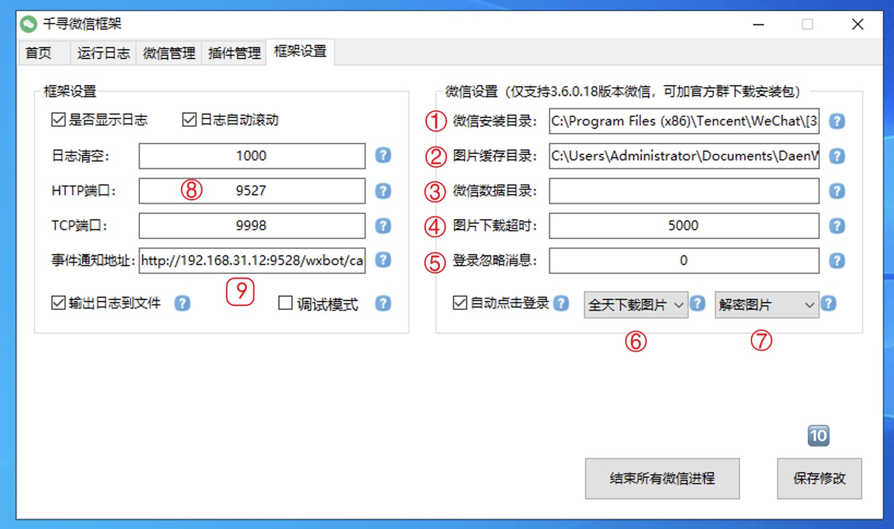
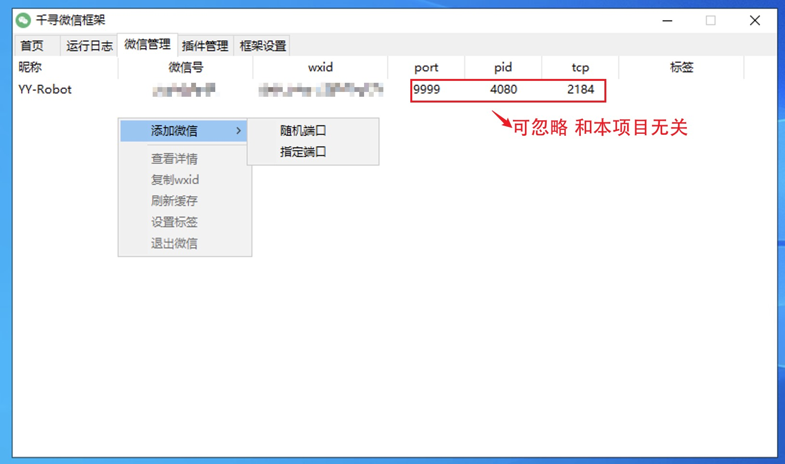
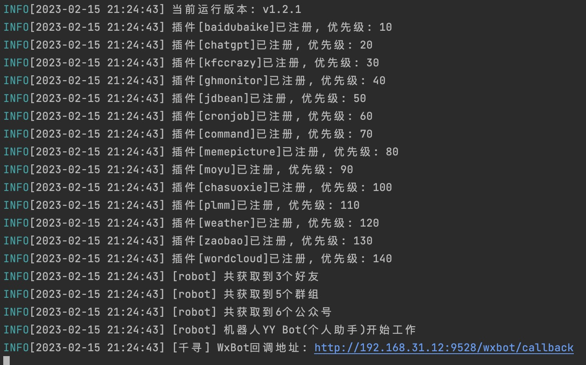

## 千寻对接文档

### 安装微信

千寻仅支持`3.6.0.18`版本的微信安装，微信安装包已上传到交流群

### 框架设置

* 步骤1，2可以点击右侧`?`符号识别，也可以自行修改
* 步骤3，4，5可默认不修改，也可自行修改
* 步骤6，7按如图设置
* 步骤8端口号自行修改，用于在本项目`config.yaml`中配置`apiUrl`时用
* 步骤9事件通知地址(回调地址)，填写本项目启动后的回调地址，端口为`config.yaml`中`serverPort`，IP为运行本项目的机器IP，如果是本地开发，IP写`localhost`而不是`127.0.0.1`，还要注意防火墙
* 修改之后步骤10点击保存

### 添加微信

右键添加微信，指定端口和随机端口都可以，然后就可以唤醒微信了

### 启动本项目

看到如下日志就可以了，此外日志中输出的回调地址也可复制粘贴到千寻框架设置中，仅供参考

