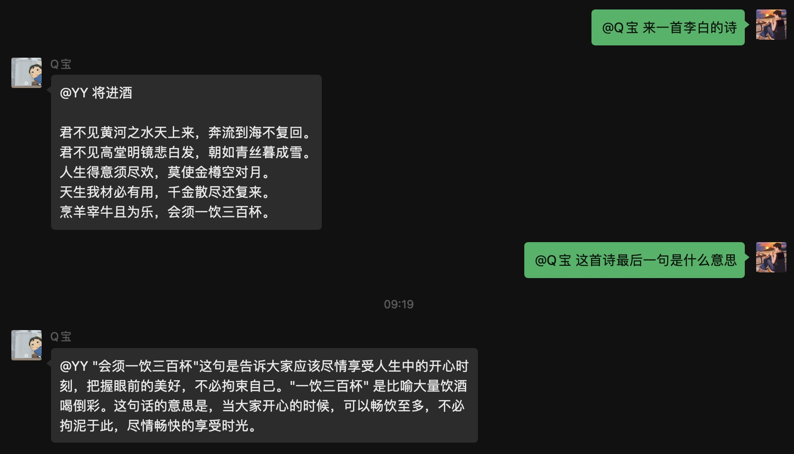

## 介绍

**🔔 注意：以下`[]`符号内代表此处是需要填写内容，并且不需要`[]`符号**

### 配置参数

* 插件名：ChatGPT聊天，已支持`GPT-3.5-turbo`模型
* 权限：所有好友和群聊
* 数据来源：https://beta.openai.com
* 注意：请先私聊机器人配置`appKey`，相关秘钥申请地址点上面链接
* 指令：
    * [x] `set chatgpt apiKey [keys]`，(多个key用`;`符号隔开)，设置ChatGPT的apiKey，`apiKey`可小写`apikey`
    * [x] `del chatgpt apiKey [keys]`，(多个key用`;`符号隔开)， 删除ChatGPT的apiKey，`apiKey`可小写`apikey`
    * [x] `set chatgpt model [key=val]`，`k`和`v`请参考下面表格，没做过多校验，请保证设置正确
    * [x] `reset chatgpt model`，重置GPT的模型配置
    * [x] `get chatgpt info` 获取ChatGPT的信息
    * [x] `set chatgpt proxy [url]`，设置api.openai.com的代理地址，需要完整的如：https://api.googlevideo.dev/v1
    * [x] `del chatgpt proxy`，删除api.openai.com 代理地址
    * [x] `set chatgpt http_proxy [url]`，设置本地http代理地址，clash如：http://127.0.0.1:7890
    * [x] `del chatgpt http_proxy`，删除本地http代理地址
    * [x] `get chatgpt (sensitive|敏感词)`，获取敏感词列表，内置了一些敏感词，如果不想使用，请使用下面删除指令
    * [x] `set chatgpt (sensitive|敏感词) [敏感词]`，设置敏感词，多个敏感词用`,`符号隔开 
    * [x] `del chatgpt (sensitive|敏感词) [敏感词]`，删除敏感词，仅支持单个敏感词
    * [x] `reset chatgpt (sensitive|敏感词)`，重置系统敏感词
    * [x] `del chatgpt system (sensitive|敏感词)`，删除系统敏感词
    * [x] `del chatgpt user (sensitive|敏感词)`，删除用户敏感词
    * [x] `del chatgpt all (sensitive|敏感词)`，删除所有敏感词
* 附录：
  * `k`，`v`可选值参考下面表格：
    |     k 可选值     | v 类型  | v 可选值                                                     |
    | :--------------: | ------- | ------------------------------------------------------------ |
    |    ModelName     | string  | 默认：`gpt-3.5-turbo` 可选：`gpt-3.5-turbo` `gpt-3.5-turbo-0301` |
    |    MaxTokens     | int     | 默认：`512`                                                  |
    |   Temperature    | float32 | 默认：`0.9`                                                  |
    |       TopP       | float32 | 默认：`1.0`                                                    |
    | FrequencyPenalty | float32 | 默认：`0.0`                                                    |
    | PresencePenalty  | float32 | 默认：`0.6`                                                    |
    | ImageSize  | string | 默认：`512x512`  可选：请参考 https://github.com/sashabaranov/go-gpt3/blob/master/image.go#L15 |

### 聊天与角色扮演

* 说明：维护每个群每个用户的上下文，可进行角色扮演，同一个用户不同群的上下文是独立的
* 指令：
    * [x] `@机器人 [内容]`，进行AI对话，计入上下文
    * [x] `@机器人 提问 [问题]`，进行单独提问，不计入上下文
    * [x] `@机器人 作画 [描述]`，进行AI作画
    * [x] `@机器人 清空会话`，可清空与您的上下文
    * [x] `@机器人 角色列表`，查看角色列表
    * [x] `@机器人 当前角色`，获取当前用户的AI角色
    * [x] `@机器人 创建角色 [角色名] [角色描述]`，创建角色
    * [x] `@机器人 删除角色 [角色名]`，删除角色
    * [x] `@机器人 切换角色 [角色名]`，切换角色

## 预览：

