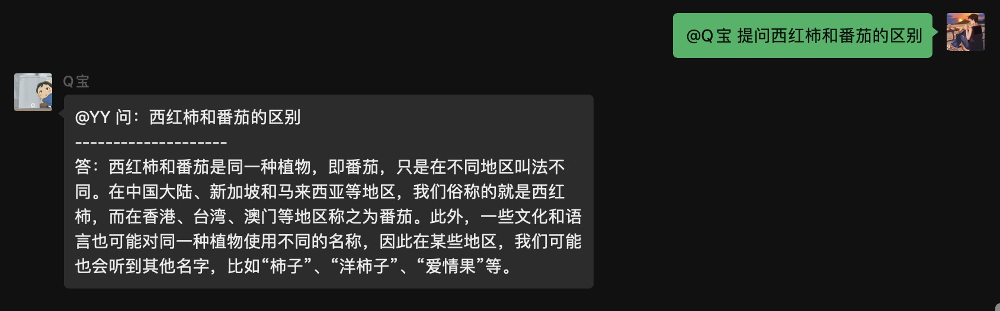

## 介绍

**🔔 注意：以下`[]`符号内代表此处是需要填写内容，并且不需要`[]`符号**

### 配置参数

* 插件名：ChatGPT聊天，已支持`GPT-3.5-turbo`模型
* 权限：所有好友和群聊
* 数据来源：https://beta.openai.com
* 注意：请先私聊机器人配置`appKey`，相关秘钥申请地址点上面链接
* 指令：
    * [x] `set chatgpt apiKey [keys]`，(多个key用`;`符号隔开)，设置ChatGPT的apiKey，`apiKey`可小写`apikey`
    * [x] `del chatgpt apiKey [keys]`，(多个key用`;`符号隔开)， 删除ChatGPT的apiKey，`apiKey`可小写`apikey`
    * [x] `set chatgpt model [key=val]`，`k`和`v`请参考下面表格，没做过多校验，请保证设置正确
    * [x] `set chatgpt model reset`，重置GPT的模型配置
    * [x] `get chatgpt info` 获取ChatGPT的信息
* 附录：
  * `k`，`v`可选值参考下面表格：
    |     k 可选值     | v 类型  | v 可选值                                                     |
    | :--------------: | ------- | ------------------------------------------------------------ |
    |    ModelName     | string  | 默认：`gpt-3.5-turbo` 可选：`gpt-3.5-turbo` `gpt-3.5-turbo-0301` |
    |    MaxTokens     | int     | 默认：`512`                                                  |
    |   Temperature    | float32 | 默认：`0.9`                                                  |
    |       TopP       | float32 | 默认：`1.0`                                                    |
    | FrequencyPenalty | float32 | 默认：`0.0`                                                    |
    | PresencePenalty  | float32 | 默认：`0.6`                                                    |
    | ImageSize  | string | 默认：`512x512`  可选：请参考 https://github.com/sashabaranov/go-gpt3/blob/master/image.go#L15 |

### 连续会话

* 说明：发送 ~~开始ChatGPT会话~~ `开始会话`即可进行连续会话，发送`结束会话`即可结束会话，或5分钟没新的提问自动结束
* 指令：
    * [x] `开始会话`，在某个聊天室内开始会话
    * [x] `结束会话`，在某个聊天室内结束会话
    * [x] `清空会话`，清空上下文

### 单独提问

* 指令：
    * [x] `提问 [问题]`，即可进行单独提问

### AI作画

* 指令：
  * [x] `作画 [描述]`，即可进行AI作画

## 预览：

