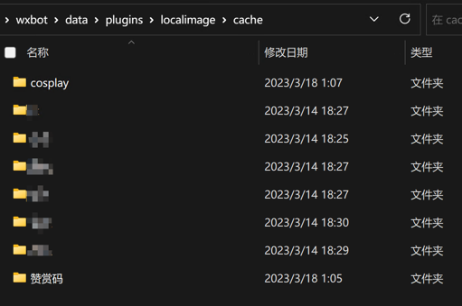
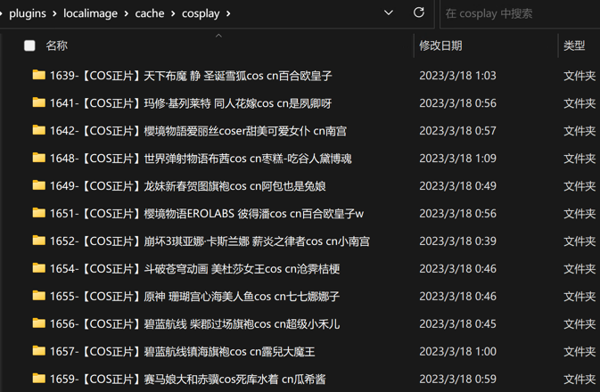
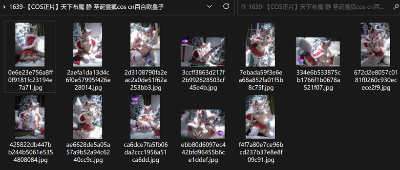

## 介绍

* 插件名：读取本地图片
* 权限：所有好友和群聊
* 指令：
    * [x] `列出图片目录`
    * [x] `来点[目录名称]图片`
    * [x] `来[数量]张[目录名称]图片`
    * [x] `来点[搜索词]图片`
    * [x] `来[数量]张[搜索词]图片`
    * [x] `[目录名称]`
    * [x] `[目录名称] [数量]`
* 说明: 
  * 本插件目的为提供一个通用的读取本地图片的插件
  * 图片放到本插件对应目录下，即可以通过上面指令读取
  * 目录规范为三层：
    * 第一层，图片分类
    * 第二层，图片说明
    * 第三层，图片明细

## 预览：

