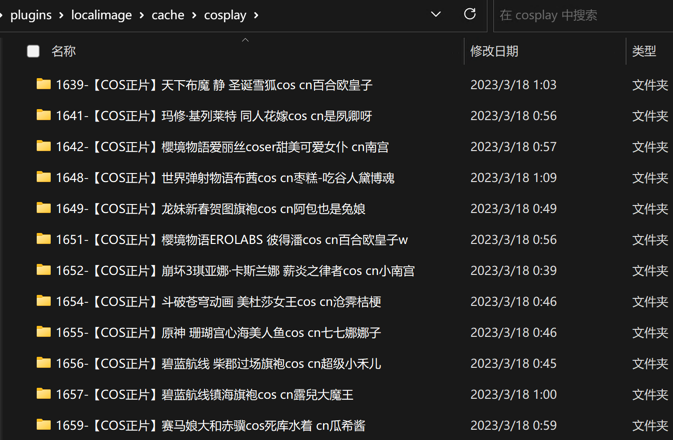

## 介绍

* 插件名：爬取图片到本地
* 权限：机器人
* 数据来源：
  * https://t2cy.com/acg/cos
  * https://t2cy.com/acg/daily
* 指令：
    * [x] `抓取Cosplay作品`
    * [x] `抓取Coser日常`
* 说明: 
  * 本插件目的为抓取网络图片到本地
  * 使用步骤：
    1. 使用 `cronjob` 插件设定插件任务，定时触发本插件，执行周期建议 1h 以上，这样做的目的是定时任务统一管理
    2. 本插件运行后，会在[读取本地图片](../localimage)插件目录下生成图片目录
    3. 通过[读取本地图片](../localimage)插件指令读取

## 预览：
