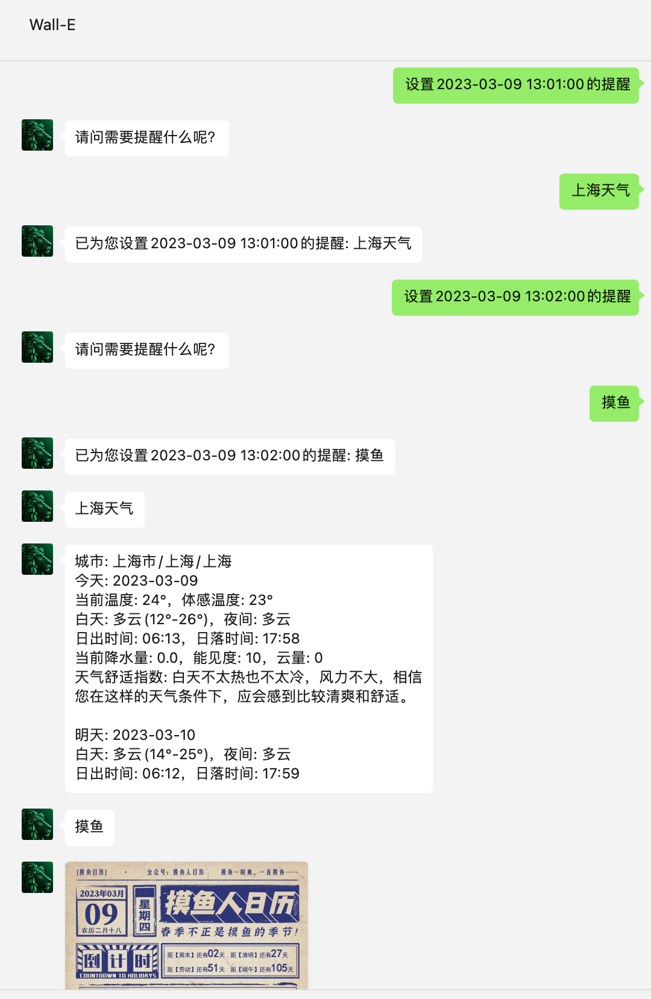

## 介绍

**🔔 注意：以下`[]`符号内代表此处是需要填写内容，并且不需要`[]`符号**

* 插件名：manager
* 插件描述：管理群组/私聊
* 权限：仅限配置的管理员使用，不区分私聊和群聊中使用
* 指令： 
    * [x] `菜单`
    * [x] `menu`，和上面的指令一样
    * [x] `设置菜单模式[1|2]`，默认为模式1文本输出，模式2为网页输出(需要配置公网地址)
    * [x] `设置每月[]号[]的提醒`，例如：设置每月8号10:00:00的提醒
    * [x] `设置每周[][]的提醒`，例如：设置每周三10:00:00的提醒
    * [x] `设置每天[]的提醒`，例如：设置每天10:00:00的提醒
    * [x] `设置每隔[]的提醒`，例如：设置每隔1小时的提醒
    * [x] `设置[]的提醒`，例如：设置2023-01-01 15:00:00的提醒
    * [x] `设置表达式[]的提醒`，例如：设置表达式(*/10 * * * * *)的提醒
    * [x] `设置每天[]执行插件`，例如：设置每天08:00:00执行插件
    * [x] `列出所有任务`
    * [x] `删除任务 [任务ID]`
    * [x] `删除全部任务`
    * [x] `删除全部提醒任务`
* 扩展：
  * 定时提醒的内容可以作为指令与插件进行联动。比如设置一个每天早晨 8:00 的提醒，提醒内容为"北京天气"，到时见就会调起`weather`插件，输出北京的天气信息
  * 

---
具体设置时间的正则如下：
```go
const (
	RegexOfRemindEveryMonth  = `^设置每月(0?[1-9]|[12][0-9]|3[01])号(([01]?[0-9]|2[0-3]):[0-5][0-9]:[0-5][0-9])的提醒$`
	RegexOfRemindEveryWeek   = `^设置每周(一|二|三|四|五|六|七|日)(([01]?[0-9]|2[0-3]):[0-5][0-9]:[0-5][0-9])的提醒$`
	RegexOfRemindEveryDay    = `^设置每天(([01]?[0-9]|2[0-3]):[0-5][0-9]:[0-5][0-9])的提醒$`
	RegexOfRemindInterval    = `^设置每隔(\d+)(s|秒|m|分|分钟|h|时|d|小时)的提醒$`
	RegexOfRemindSpecifyTime = `^设置((20[2-9][0-9]|2100)-(0[1-9]|1[0-2])-(0[1-9]|[12][0-9]|3[01])\s([01][0-9]|2[0-3]):[0-5][0-9]:[0-5][0-9])的提醒$`
	RegexOfRemindExpression  = `^设置表达式\((((\*(/\d+)?|((\d+(-\d+)?)(,\d+(-\d+)?)*))(/\d+)?)\s+(\*(/\d+)?|((\d+(-\d+)?)(,\d+(-\d+)?)*))(/\d+)?\s+(\*(/\d+)?|((\d+(-\d+)?)(,\d+(-\d+)?)*))(/\d+)?\s+(\*(/\d+)?|((\d+(-\d+)?)(,\d+(-\d+)?)*))(/\d+)?\s+(\*(/\d+)?|((\d+(-\d+)?)(,\d+(-\d+)?)*))(/\d+)?\s+(\*(/\d+)?|((\d+(-\d+)?)(,\d+(-\d+)?)*))(/\d+)?)\)的提醒$`
	RegexOfPluginEveryDay    = `^设置每天(([01]?[0-9]|2[0-3]):[0-5][0-9]:[0-5][0-9])执行插件$`
)
```