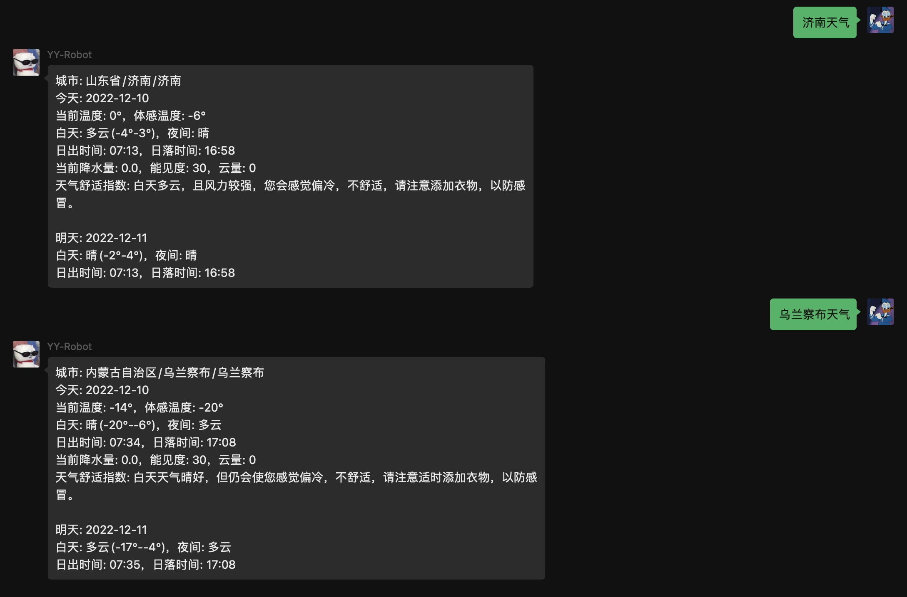

## 介绍

**🔔 注意：以下`[]`符号内代表此处是需要填写内容，并且不需要`[]`符号**

* 插件名：查天气
* 权限：所有好友和群聊
* 数据来源：https://dev.qweather.com
* 注意：请先私聊机器人配置`appKey`，相关秘钥申请地址点上面链接
* 指令：
    * [x] `[城市名]天气`
    * [x] `set weather appKey [appKey]` 设置和风天气apiKey
    * [x] `get weather info` 获取当前插件信息

## 预览：

